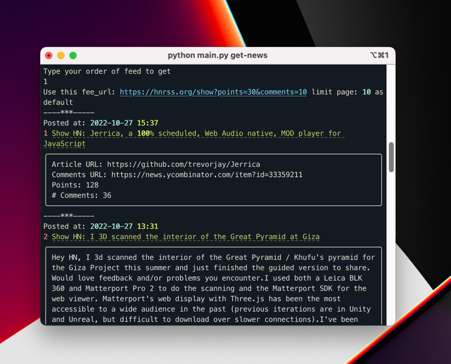

# ALAN CLI TOOLSET

**********
This CLI toolset is built to serve my everyday need of news and information inside the CLI.In the future, I will also
support other format rather than just RSS.

How to use it (currently I haven't specified the setups , should be up pretty soon). First you install the
requirements.txt

## How to install the app
App is packaged on pip
```shell
pip install alan-cli
```

## How to use the app
Type the below command for help
```shell
alan-cli --help
```
Please remember to input the rss using rss manager in order for the manager to have data.

You can use above command to get the news after you have input the rss
```shell
alan-cli get-news
```
